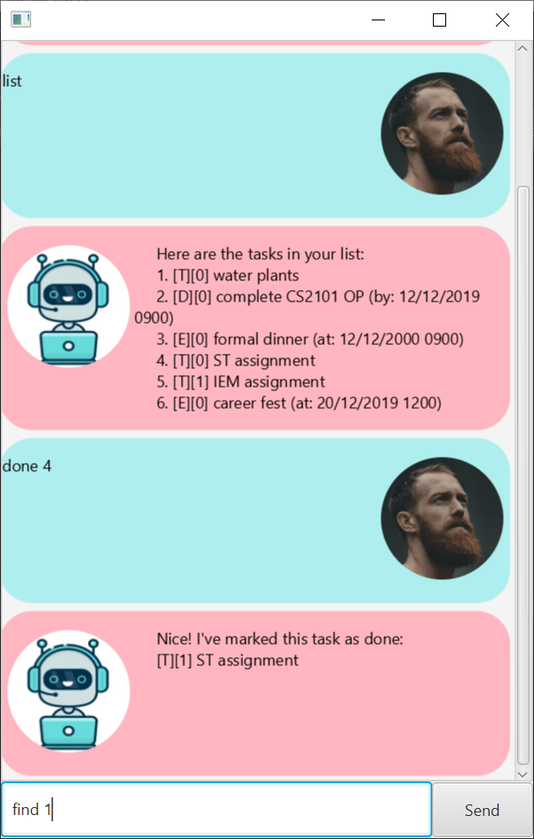

= Duke - UserGuide
:toc:
:sectnums:
:repoLink: https://github.com/shaoyi1997/duke

== Introduction
Duke is a desktop app for *managing your tasks*. If you prefer to work with a Command Line
Interface, this is the app for you! The app provides several feature that allows you to add,
track and update your task list with simple and intuitive commands. Duke will automatically
save your task list into a local text file found in your Duke folder and load it when you run
Duke again, so you don't have to worry about losing your task list!

Jump to <<Quick Start>> to get started. Have fun!

== Quick Start

. Ensure you have Java `11` or above installed in your Computer.
. Download the latest `duke.jar` link:{repoLink}/releases[here].
. Double-click the jar file to run the app. Please wait a few seconds for the app to start up.

+

+

. Type commands in the command box at the bottom of the app and press kbd:[Enter] to execute it. +
eg. typing *`list`* and pressing kbd:[Enter] will list all the tasks in the tasks list.
. Here are some commands that you can try:

.. *`todo read Clean Code by Robert Martin`*: adds a `todo` task with the corresponding description.
.. *`list`*: lists all the tasks in the list.
.. *`bye`*: exits the app.

. Refer to <<Features>> for the full formatting of all commands available.

== Features

====
*Command Specification*

* Words in `UPPER_CASE` are to be supplied by you.
** e.g. in `todo DESCRIPTION`, `DESCRIPTION` should be replaced with the description of the todo
task you want to add, such as `todo water plants`.
* Words in square brackets are optional.
** e.g. `update 1 [/description DESCRIPTION] [/datetime DATETIME]` can be used as `update 1
/description read book` or `update 1 /description read book /datetime 12/12/2019 0900`.
* Parameters can be given in any order.
** e.g. `update 1 /description read book` or `update 1 /description read book /datetime
12/12/2019 0900` both results in the same command.
* All `INDEX` parameters in the command format refers to the index number of the task as shown in
the displayed task list.
** i.e. the index is a positive integer, starting from 1.
====

=== Listing all tasks

Shows the list of tasks saved in the Duke app.

*Format*: `list`

=== Adding a new task

Creates a new task and adds it in the task list. +
Duke enables you to create 3 types of tasks: `todo`, `event`, and `deadline`. +
All tasks require a description to be attached to it. +
A 24hr date time format is required for the `event` and `deadline` tasks.

*Format*:

* `todo DESCRIPTION`
* `deadline DESCRIPTION /by DD/MM/YY HHMM`
* `event DESCRIPTION /at DD/MM/YY HHMM`

*Examples*:

* `todo read book` +
Creates a read book `todo` task.
* `event book fest /at 1/1/2019 0800` +
Creates a book fest `event` held at `1/1/2019 0800`.
* `deadline finish reflection /by 2/2/2019 0800` +
Creates a finish reflection deadline, with the deadline at `2/2/2019 0800`.

=== Marking a task as done

Marks a task, given by its index, as done.

*Format*: `done INDEX`

*Example*:

* `done 1` +
Marks the first task in the task list as done.

=== Finding a task by keyword

Searches for task(s) whose description contains the keyword.

* You can query only *1 keyword*.
* Keyword is *not case-sensitive*.
* The keywords ordering do not matter.
** eg. `find plant book` and `find book plant` returns the same matching tasks.
* Only the description of the tasks will be searched.
** i.e. you cannot search a task by its `datetime` field.

*Format*: `find KEYWORD`.

*Example*:

* `find book` +
Displays all tasks with `book` in their description.

=== Updating a task

Updates the description and/or datetime field of a task, given by its index. +
A *minimum of one field must be updated* for the command to be valid.

*Format*: `update INDEX [/description DESCRIPTION] [/datetime DATETIME]`

*Examples*:

* `update 1 /description read book /datetime 12/12/2019 0900` +
Updates task at index 1, such that its `description` field is changed to `read book` and its
`datetime` field is changed to `12/12/2019 0900`.
* `update 1 /datetime 12/12/2019 0900` +
Updates task at index 1, such that its `datetime` field is changed to `12/12/2019 0900`.

=== Cloning a task

Creates a new copy of an existing task, given by its index. +
The new task is added to the back of the list.

*Format*: `clone INDEX`

*Example*:

* `clone 1` +
Clones the first task in the task list and adds it after the last previous task entry.

=== Deleting a task

Deletes an existing task, given by its index, in the list.

*Format*: `delete INDEX`

*Example*:

* `delete 1` +
Deletes the first task in the task list.

=== Exiting the app

Exits the Duke app.

*Format*: `bye`

== FAQ

*Q*: Can I transfer my data to another computer? +
*A*: Yes! When you run Duke for the first time, it will create an empty text file to save your
tasks list. You can simply overwrite it with your existing data file and Duke will load your
tasks list when you run it next time!

== Command Summary

* *Listing all tasks*: `list`
* *Adding a task*
** `todo DESCRIPTION`
** `deadline DESCRIPTION /by DD/MM/YY HHMM`
** `event DESCRIPTION /at DD/MM/YY HHMM`
* *Marking a task as done*: `done INDEX`
* *Finding a task*: `find KEYWORD`
* *Updating a task*: `update INDEX [/description DESCRIPTION] [/datetime DATETIME]`
* *Cloning a task*: `clone INDEX`
* *Deleting a task*: `delete INDEX`
* *Exiting the app*: `bye`
